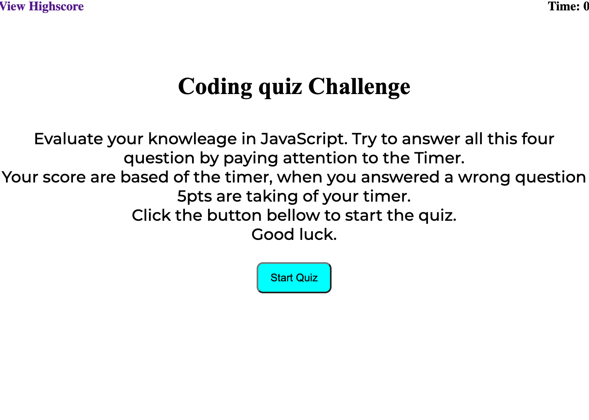

# Code-Quiz
## Description
 Code quiz is a timed quiz on JavaScript fundamentals that stores high scores.
 Core skills input:
 - Timer.
 - Create an Append.
 - Local Storage.
 ## Mock-Up

## Link
* URL of the deployed application.

*  URL of  GitHub repository

# Collaborator
David dyer